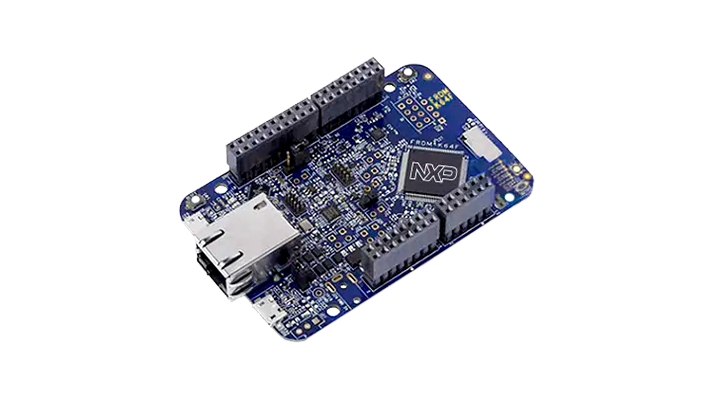
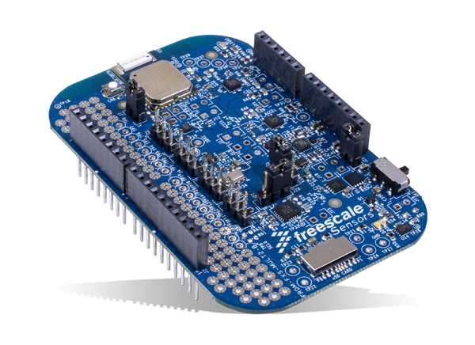
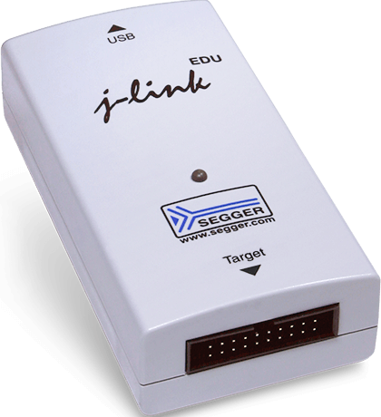

# Sensor fusion using a FRDM-K64F and FRDM-FXS-MULT2-B

Sources: [NXP® Sensor Fusion](https://www.nxp.com/design/sensor-developer-resources/nxp-sensor-fusion:XTRSICSNSTLBOXX)

## Boards
### [FRDM-K64F](https://www.nxp.com/design/development-boards/freedom-development-boards/mcu-boards/freedom-development-platform-for-kinetis-k64-k63-and-k24-mcus:FRDM-K64F)


### [FRDM-FXS-MULT2-B](https://www.nxp.com/design/development-boards/freedom-development-boards/sensors/freedom-development-platform-for-nxp-sensors-with-bluetooth-:FRDM-FXS-MULT2-B)


## Protocol
The default size of the buffer is 152 bytes according to the code and debugger.

Data order see `sensor_fusion/output_stream.c`
```
    // ************************************************************************
    // Main type 1: range 0 to 35 = 36 bytes
    // Debug type 2: range 0 to 7 = 8 bytes
    // Angular velocity type 3: range 0 to 13 = 14 bytes
    // Euler angles type 4: range 0 to 13 = 14 bytes
    // Altitude/Temp type 5: range 0 to 13 = 14 bytes
    // Magnetic type 6: range 0 to 16 = 18 bytes
    // Kalman packet 7: range 0 to 47 = 48 bytes
    // Precision Accelerometer packet 8: range 0 to 46 = 47 bytes
    //
    // Total excluding intermittent packet 8 is:
    // 152 bytes vs 256 bytes size of sUARTOutputBuffer
    // at 25Hz, data rate is 25*152 = 3800 bytes/sec = 38.0kbaud = 33% of 115.2kbaud
    // at 40Hz, data rate is 40*152 = 6080 bytes/sec = 60.8kbaud = 53% of 115.2kbaud
    // at 50Hz, data rate is 50*152 = 7600 bytes/sec = 76.0kbaud = 66% of 115.2kbaud
    // ************************************************************************
    // ************************************************************************
    // fixed length packet type 1
    // this packet type is always transmitted
    // total size is 0 to 35 equals 36 bytes
    // ************************************************************************

	Main type 1:
    // [0]: packet start byte (need a iIndex++ here since not using sBufAppendItem)
    // [1]: packet type 1 byte (iIndex is automatically updated in sBufAppendItem)
    // [2]: packet number byte
    // [6-3]: 1MHz time stamp (4 bytes)
    // [12-7]: integer accelerometer data words (scaled to 8192 counts per g for PC GUI)
    // send non-zero data only if the accelerometer sensor is enabled and used by the selected quaternion
    // [18-13]: integer calibrated magnetometer data words (already scaled to 10 count per uT for PC GUI)
    // send non-zero data only if the magnetometer sensor is enabled and used by the selected quaternion
    // [24-19]: uncalibrated gyro data words (scaled to 20 counts per deg/s for PC GUI)
    // send non-zero data only if the gyro sensor is enabled and used by the selected quaternion
    // flags byte 33: quaternion type in least significant nibble
    // Q3:   coordinate nibble, 1
    // Q3M:	 coordinate nibble, 6
    // Q3G:	 coordinate nibble, 3
    // Q6MA: coordinate nibble, 2
    // Q6AG: coordinate nibble, 4
    // Q9:   coordinate nibble, 8
    // flags byte 33: coordinate in most significant nibble
    // Aerospace/NED:	0, quaternion nibble
    // Android:	  		1, quaternion nibble
    // Windows 8: 		2, quaternion nibble
    // set the quaternion, flags, angular velocity and Euler angles
    // [32-25]: scale the quaternion (30K = 1.0F) and add to the buffer
    // [33]: add the flags byte to the buffer
    // [34]: add the shield (bits 7-5) and Kinetis (bits 4-0) byte
    // [35]: add the tail byte for the standard packet type 1

	Debug type 2:
        // [0]: packet start byte
        // [1]: packet type 2 byte
        // [2]: packet number byte
        // [4-3] software version number
        // [6-5] systick count / 20
        // [7 in practice but can be variable]: add the tail byte for the debug packet type 2

    Angular velocity type 3:
        // [0]: packet start byte
        // [1]: packet type 3 byte (angular velocity)
        // [2]: packet number byte
        // [6-3]: time stamp (4 bytes)
        // [12-7]: add the scaled angular velocity vector to the output buffer
        // [13]: add the tail byte for the angular velocity packet type 3

    Euler angles type 4:
        // [0]: packet start byte
        // [1]: packet type 4 byte (Euler angles)
        // [2]: packet number byte
        // [6-3]: time stamp (4 bytes)
        // [12-7]: add the angles (resolution 0.1 deg per count) to the transmit buffer
        // [13]: add the tail byte for the roll, pitch, compass angle packet type 4

    Altitude/Temp type 5:
            // [0]: packet start byte
            // [1]: packet type 5 byte
            // [2]: packet number byte
            // [6-3]: time stamp (4 bytes)
            // [10-7]: altitude (4 bytes, metres times 1000)
            // [12-11]: temperature (2 bytes, deg C times 100)
            // [13]: add the tail byte for the altitude / temperature packet type 5

    Magnetic type 6:
        // [0]: packet start byte
        // [1]: packet type 6 byte
        // [2]: packet number byte
        // [4-3]: number of active measurements in the magnetic buffer
        // [6-5]: fit error (%) with resolution 0.01%
        // [8-7]: geomagnetic field strength with resolution 0.1uT
        // [10-9]: int16_t: ID of magnetic variable to be transmitted
        // ID 0 to 4 inclusive are magnetic calibration coefficients
        // ID 5 to 9 inclusive are for future expansion
        // ID 10 to (MAGBUFFSIZEX=12) * (MAGBUFFSIZEY=24)-1 or 10 to 10+288-1 are magnetic buffer elements
        // where the convention is used that a negative value indicates empty buffer element (index=-1)
        // [12-11]: int16_t: variable 1 to be transmitted this iteration
        // [14-13]: int16_t: variable 2 to be transmitted this iteration
        // [16-15]: int16_t: variable 3 to be transmitted this iteration
        // [17]: add the tail byte for the magnetic packet type 6

    Kalman packet 7:
            // [0]: packet start byte
            // [1]: packet type 7 byte
            // [2]: packet number byte
            // [4-3]: fzgErr[CHX] resolution scaled by 30000
            // [6-5]: fzgErr[CHY] resolution scaled by 30000
            // [8-7]: fzgErr[CHZ] resolution scaled by 30000
            // [10-9]: fgErrPl[CHX] resolution scaled by 30000
            // [12-11]: fgErrPl[CHY] resolution scaled by 30000
            // [14-13]: fgErrPl[CHZ] resolution scaled by 30000
            // [16-15]: fzmErr[CHX] resolution scaled by 30000
            // [18-17]: fzmErr[CHY] resolution scaled by 30000
            // [20-19]: fzmErr[CHZ] resolution scaled by 30000
            // [22-21]: fmErrPl[CHX] resolution scaled by 30000
            // [24-23]: fmErrPl[CHY] resolution scaled by 30000
            // [26-25]: fmErrPl[CHZ] resolution scaled by 30000
            // [28-27]: fbPl[CHX] resolution 0.001 deg/sec
            // [30-29]: fbPl[CHY] resolution 0.001 deg/sec
            // [32-31]: fbPl[CHZ] resolution 0.001 deg/sec
            // [34-33]: fDeltaPl resolution 0.01deg
            // [36-35]: fAccGl[CHX] resolution 1/8192 g
            // [38-37]: fAccGl[CHY] resolution 1/8192 g
            // [40-39]: fAccGl[CHZ] resolution 1/8192 g
            // [42-41]: fDisGl[CHX] resolution 0.01m
            // [44-43]: fDisGl[CHY] resolution 0.01m
            // [46-45]: fDisGl[CHZ] resolution 0.01m
            // [47]: add the tail byte for the Kalman packet type 7

    Precision Accelerometer packet 8:
        // [0]: packet start byte (need a iIndex++ here since not using sBufAppendItem)
        // [1]: packet type 8 byte (iIndex is automatically updated in sBufAppendItem)
        // [2]: packet number byte
        // [3]: AccelCalPacketOn in range 0-11 denotes stored location and MAXORIENTATIONS denotes transmit
        // precision accelerometer calibration on power on before any measurements have been obtained.
        // [9-4]: stored accelerometer measurement fGs (scaled to 8192 counts per g)
        // [15-10]: precision accelerometer offset vector fV (g scaled by 32768.0)
        // [21-16]: precision accelerometer inverse gain matrix diagonal finvW - 1.0 (scaled by 10000.0)
        // [27-22]: precision accelerometer inverse gain matrix off-diagonal finvW (scaled by 10000)
        // [33-28]: precision accelerometer rotation matrix diagonal fR0 (scaled by 10000)
        // [45-34]: precision accelerometer inverse rotation matrix off-diagonal fR0 (scaled by 10000)
        // [46]: add the tail byte for the packet type 8
```

## Toolchain setup
### CLion
#### macOS
`Preferences` -> `Build, Execution, Deployment` -> `Toolchains`
```
Name: GNU ARM GCC - Official
Make: /usr/bin/make
C Compiler: /Applications/ARM/bin/arm-none-eabi-gcc
C++ Compiler: /Applications/ARM/bin/arm-none-eabi-g++
Debugger: /Applications/ARM/bin/arm-none-eabi-gdb
```
```
Name: GNU ARM GCC - MCUXpresso
Make: /opt/local/bin/gmake
C Compiler: /Applications/MCUXpressoIDE_11.3.0_5222/ide/plugins/com.nxp.mcuxpresso.tools.macosx_11.3.0.202011031536/tools/bin/arm-none-eabi-gcc
C++ Compiler: /Applications/MCUXpressoIDE_11.3.0_5222/ide/plugins/com.nxp.mcuxpresso.tools.macosx_11.3.0.202011031536/tools/bin/arm-none-eabi-g++
Debugger: /Applications/MCUXpressoIDE_11.3.0_5222/ide/plugins/com.nxp.mcuxpresso.tools.macosx_11.3.0.202011031536/tools/bin/arm-none-eabi-gdb
```

`Preferences` -> `Build, Execution, Deployment` -> `CMake` -> `Profiles`
```
Name: Debug ARM GCC
Build type: Debug
Toolchain: GNU ARM GCC - Official
CMake options: -DCMAKE_TOOLCHAIN_FILE=GNUARMGCCToolchain.cmake
Build options: -- -j 8
```
```
Name: Debug MCUXpresso
Build type: Debug
Toolchain: GNU ARM GCC - MCUXpresso
CMake options: -DCMAKE_TOOLCHAIN_FILE=MCUXpressoGCCToolchain.cmake
Build options: -- -j 8
```

## Build
### MCUXpresso output postbuild
```
Building target: frdmk64f_mult2b_sensorfusion_bm_mult2b.axf
Invoking: MCU Linker
arm-none-eabi-gcc -nostdlib -Xlinker -Map="frdmk64f_mult2b_sensorfusion_bm_mult2b.map" -Xlinker --gc-sections -Xlinker -print-memory-usage -Xlinker --sort-section=alignment -Xlinker --cref -mcpu=cortex-m4 -mfpu=fpv4-sp-d16 -mfloat-abi=hard -mthumb -T frdmk64f_mult2b_sensorfusion_bm_mult2b_Debug.ld -o "frdmk64f_mult2b_sensorfusion_bm_mult2b.axf"  ./utilities/fsl_assert.o ./utilities/fsl_debug_console.o ./utilities/fsl_str.o ./utilities/systick_utils.o  ./startup/startup_mk64f12.o  ./source/main_baremetal.o ./source/semihost_hardfault.o  ./sensors/fxas21002_drv.o ./sensors/fxos8700_drv.o ./sensors/mpl3115_drv.o  ./sensor_fusion/DecodeCommandBytes.o ./sensor_fusion/approximations.o ./sensor_fusion/calibration_storage.o ./sensor_fusion/control.o ./sensor_fusion/debug.o ./sensor_fusion/driver_FXAS21002.o ./sensor_fusion/driver_FXOS8700.o ./sensor_fusion/driver_KSDK_NVM.o ./sensor_fusion/driver_MPL3115.o ./sensor_fusion/driver_pit.o ./sensor_fusion/driver_systick.o ./sensor_fusion/fusion.o ./sensor_fusion/hal_frdm_fxs_mult2_b.o ./sensor_fusion/magnetic.o ./sensor_fusion/matrix.o ./sensor_fusion/orientation.o ./sensor_fusion/output_stream.o ./sensor_fusion/precisionAccelerometer.o ./sensor_fusion/sensor_fusion.o ./sensor_fusion/status.o  ./interfaces/register_io_i2c.o ./interfaces/register_io_spi.o ./interfaces/sensor_io_i2c.o ./interfaces/sensor_io_spi.o  ./gpio_driver/gpio_driver.o ./gpio_driver/gpio_driver_irq.o  ./drivers/fsl_clock.o ./drivers/fsl_common.o ./drivers/fsl_dmamux.o ./drivers/fsl_dspi.o ./drivers/fsl_dspi_cmsis.o ./drivers/fsl_dspi_edma.o ./drivers/fsl_edma.o ./drivers/fsl_ftfx_cache.o ./drivers/fsl_ftfx_controller.o ./drivers/fsl_ftfx_flash.o ./drivers/fsl_ftfx_flexnvm.o ./drivers/fsl_gpio.o ./drivers/fsl_i2c.o ./drivers/fsl_i2c_cmsis.o ./drivers/fsl_i2c_edma.o ./drivers/fsl_pit.o ./drivers/fsl_smc.o ./drivers/fsl_uart.o ./drivers/fsl_uart_cmsis.o ./drivers/fsl_uart_edma.o  ./device/system_MK64F12.o  ./component/uart/uart_adapter.o  ./component/serial_manager/serial_manager.o ./component/serial_manager/serial_port_uart.o  ./component/lists/generic_list.o  ./board/board.o ./board/clock_config.o ./board/frdm_k64f.o ./board/pin_mux.o   
Memory region         Used Size  Region Size  %age Used
PROGRAM_FLASH:         100832 B         1 MB      9.62%
SRAM_UPPER:             19760 B       192 KB     10.05%
SRAM_LOWER:                0 GB        64 KB      0.00%
FLEX_RAM:                  0 GB         4 KB      0.00%
Finished building target: frdmk64f_mult2b_sensorfusion_bm_mult2b.axf

make --no-print-directory post-build
Performing post-build steps
arm-none-eabi-size "frdmk64f_mult2b_sensorfusion_bm_mult2b.axf"; # arm-none-eabi-objcopy -v -O binary "frdmk64f_mult2b_sensorfusion_bm_mult2b.axf" "frdmk64f_mult2b_sensorfusion_bm_mult2b.bin" ; # checksum -p MK64FN1M0xxx12 -d "frdmk64f_mult2b_sensorfusion_bm_mult2b.bin";
text	   data	    bss	    dec	    hex	filename
100664	    168	  19592	 120424	  1d668	frdmk64f_mult2b_sensorfusion_bm_mult2b.axf
```

## Debugging

### VS Code
Add the following to `.vscode/launch.json`
```
{
    // Use IntelliSense to learn about possible attributes.
    // Hover to view descriptions of existing attributes.
    // For more information, visit: https://go.microsoft.com/fwlink/?linkid=830387
    "version": "0.2.0",
    "configurations": [
        {
            "type": "cortex-debug",
            "request": "launch",
            "name": "sensorfusion_bm_mult2b J-Link",
            "cwd": "${workspaceRoot}",
            "executable": "${command:cmake.launchTargetPath}",
            "serverpath": "/Applications/SEGGER/JLink_V646k/JLinkGDBServer",
            "servertype": "jlink",
            "device": "MK64FN1M0xxx12",
            "interface": "swd",
            "jlinkscript": "",
            "runToMain": true,
            "armToolchainPath": "${env:GNU_ARM_GCC_TOOLCHAIN_DIR}",
            "svdFile": "${workspaceRoot}/MK64F12.svd"
        }
    ]
}
```
#### Output
```
Launching server: "/Applications/SEGGER/JLink_V646k/JLinkGDBServer" "-if" "swd" "-port" "50000" "-swoport" "50001" "-telnetport" "50002" "-device" "MK64FN1M0xxx12"
```

### CLion
`Run/Debug Configurations` -> `Embedded GDB Server`
```
'target remote' args: tcp:localhost:2331
GDB Server: /Applications/SEGGER/JLink_V646k/JLinkGDBServer
```

#### STM32F407IG
```
```

#### MK64FN1M0xxx12
##### JTAG
```
```

#### SWD (OpenSDA)
```
GDB Server args: -if swd -port 2331 -swoport 2332 -telnetport 2333 -device MK64FN1M0xxx12
```

### SEGGER J-Link EDU debug probe



#### OpenSDA firmware from Segger to debug over USB

With the OpenSDA firmware no debug probe is required.

[OpenSDA / OpenSDA V2 Firmware](https://www.segger.com/products/debug-probes/j-link/models/other-j-links/opensda-sda-v2/)

| Board     | Firmware version  |
|:----------|:-----------------:|
| FRDM-K64F | 2.0               |
| FRDM-K66F | 2.1               |

Download the firmware from the section `J-Link OpenSDA - Board-Specific Firmwares` in the download area.

#### Reflash the FRDM-K64F bootloader
> **NOTE**: Using the FRDM-K64F on Windows 10 can damage the board or make it unusable (see [DAPLink bootloader update](https://os.mbed.com/blog/entry/DAPLink-bootloader-update/))

Download bootloader from [DAPLink bootloader update](https://os.mbed.com/blog/entry/DAPLink-bootloader-update/) in section `Updating the DAPLink bootloader`

Run `/Applications/SEGGER/JLink_V694a/JLinkExe` (on macOS)
```
J-Link>device MK64FN1M0xxx12
J-Link>connect
JTAGConf>loadbin /Users/<user>/Downloads/0244_k20dx_bootloader_update_0x5000.bin, 0
```
